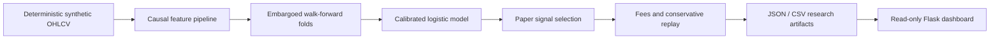

# Crypto ML Research Engine


A standalone, security-first portfolio project that demonstrates how I design
machine-learning research systems: causal feature engineering, time-aware validation, calibrated
probabilities, cost-adjusted paper evaluation, conservative trade replay and a
small monitoring dashboard.

> **Important:** this public repository is an educational research showcase.
> It cannot connect to an exchange, cannot place orders, contains no real trading
> history and is not financial advice.

## Why this project exists

Many trading demos report one optimistic backtest score and ignore data leakage,
probability calibration, fees and ambiguous fills. This project focuses on the
engineering controls that make an experiment reproducible and auditable.

- Expanding-window walk-forward validation; never shuffled cross-validation
- Embargo between training and test windows
- Sigmoid probability calibration with Brier score and log loss
- Net expected value after configurable round-trip costs
- Conservative SL-first handling when SL and TP occur in the same candle
- Deterministic synthetic OHLCV data with multiple volatility regimes
- Zero exchange credentials and zero live-order functionality
- Automated tests and a publication-time credential scanner

## Dashboard


The dashboard exposes research metrics only. Its health endpoint explicitly
reports `trading: disabled`.

## Architecture



This repository is fully standalone and does not depend on a separate rules
bot. The public version intentionally omits proprietary production rules,
private datasets, social integrations, broker/exchange adapters and runtime state.

## Quick start

```bash
python -m venv .venv
# Windows: .venv\Scripts\activate
# macOS/Linux: source .venv/bin/activate
pip install -r requirements.txt
python -m src.market_research.pipeline --demo
python dashboard/app.py
```

Open `http://localhost:5000`.

Docker alternative:

```bash
docker build -t crypto-research-demo .
docker run --rm -p 5000:5000 crypto-research-demo
```

## Repository layout

```text
src/market_research/
  synthetic.py       deterministic multi-regime OHLCV generator
  features.py        closed-candle, causal feature engineering
  evaluation.py      calibration and embargoed walk-forward evaluation
  trade_math.py      conservative ordered-candle SL/TP replay
  pipeline.py        reproducible demo entry point
dashboard/           read-only Flask research dashboard
tests/               finance-critical unit tests
scripts/             publication safety scanner
artifacts/demo/      generated synthetic reports (no private data)
```

## Evaluation contract

1. Features at time `t` use information available at or before `t`.
2. Test windows are chronologically later than their training windows.
3. An embargo separates train and test rows.
4. Model selection is evaluated out of sample.
5. Reported paper returns subtract the configured round-trip cost.
6. A paper result is not evidence of future profitability.

## Security and privacy

- `.env`, databases, logs, model binaries and runtime files are ignored.
- `.env.example` contains configuration names but no credentials.
- `scripts/prepublish_check.py` blocks common secret patterns and private files.
- GitHub Actions runs the tests, scanner and full synthetic pipeline.
- No IP addresses, account identifiers or real portfolio data are included.

Run the safety checks before publishing:

```bash
python -m unittest discover -s tests -v
python scripts/prepublish_check.py
```

## Honest limitations

- Synthetic data is useful for validating software behavior, not market edge.
- The baseline model is deliberately interpretable and modest.
- Candle data cannot reveal the exact intrabar path; ambiguous fills are handled
  conservatively.
- Live execution, slippage measurement and fill reconciliation are out of scope.

## Skills demonstrated

Python · pandas · scikit-learn · Flask · time-series validation · probability
calibration · paper-trading simulation · REST APIs · testing · Docker · CI/CD ·
secret management · technical documentation

## License

MIT. See `LICENSE`.
